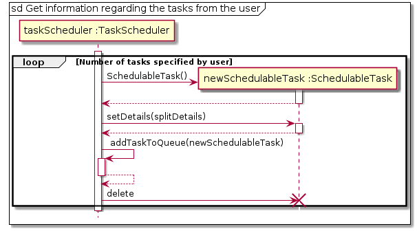

[comment]: # (@@author NizarMohd)
<!-- top button was extracted from https://www.w3schools.com/howto/howto_js_scroll_to_top.asp -->

<button onclick="topFunction()" id="topButton" title="Go to top">Top</button>

<a href="https://ay1920s2-cs2113t-t12-3.github.io/tp/" class="backlink">Back to OrgaNice!'s main page</a>
# Developer Guide    

## Table of content
1. [Introduction](#1-introduction) 
    1.1. [Purpose](#11-purpose) 
    1.2. [Target Reader](#12-target-reader) 
    1.3. [Brief Description](#13-brief-description) 
    1.4. [Main Features](#14-main-features)
1. [Design](#2-design) 
    2.1. [Architecture](#21-architecture) 
    2.2. [Task Component](#22-task-component) 
    2.3. [Study Area Component](#23-study-area-component) 
    2.4. [Notes Component](#24-notes-component) 
1. [Implementation](#3-implementation) 
    3.1. [Scheduling Tasks](#31-scheduling-tasks) 
    3.2. [Listing Study Areas](#32-listing-study-areas) 
    3.3. [Operation of Notes](#33-operation-of-notes) 
1. [Testing](#4-testing) 

[Appendix A: Product Scope](#appendix-a-product-scope) 
[Appendix B: User Stories](#appendix-b-user-stories) 
[Appendix C: Non-Functional Requirements](#appendix-c-non-functional-requirements) 
[Appendix D: Glossary](#appendix-d-glossary) 
[Appendix E: Instruction for Manual Testing](#appendix-e-instructions-for-manual-testing) 

## 1. Introduction

### 1.1. Purpose

The document is meant to guide you on how OrgaNice! was developed and the design and implementations behind the software.
With this document, you should have a better understanding of the framework of the application. 

### 1.2. Target Reader

The target reader of this developer guide are:

- Project Managers
- Future Developers
- Build Verification Testers

### 1.3. Brief Description

OrgaNice! is a task manager integrated with a Study Area search function. You can use it to manage your tasks, be it events or deadlines. On top of that, 
it is capable of assisting students in finding Study Areas that meet their desired criteria.

### 1.4. Main Features

1. Scheduling Tasks
    - You can manage tasks based on priority for events and countdown for deadlines. For more information on the design and implementation for this feature, click [here](#31-scheduling-tasks)
1. Study Area. 
    - You can find a Study Area that meets your criteria. The software, however, have a limited number of supported 
    criteria. For more information on the design and implementation for this feature, click [here](#32-listing-study-areas)
1. Notes
	- You can enter notes based on school modules. Notes support undo and redo operations. For more information on the design and implementation for this feature, click [here](#33-operation-of-notes)

## 2. Design   

[comment]: # (@@author GanapathySanathBalaji)
### 2.1. Architecture  
  

Figure 1. Overall Architecture of OrgaNice!

 

1. Duke - The Main component which controls the flow of execution.

1. Ui - Component used to get input from the user and display results on the monitor.

1. Parser - Component used to abstract out the command based on the user's input, so that the command can be executed later.

1. Command - Component contains information and implementation on how to execute various types of commands.

1. Task - Component contains details about handling the task list and related operations.

1. StudyArea - Component contains details about handling queries for study area search.

1. Notes - Component contains details about Notes related operations.

1. Exception - Component contains the various types of exceptions encountered when OrgaNice! is run.

1. ResourceLoader - Component handles loading and saving of the task list and study area details to local storage.

### 2.2. Task Component  
  

[comment]: # (@@author GanapathySanathBalaji)  
  
The Task component depends on 3 other components,   
  
 1. Command Component - The Command component issues instructions for the Task component to execute based on the user's input.  
 
 2. UI Component - The UI component is used to display the results (and related exceptions) of the commands issued to the Task Component. 
 
 3. ResourceLoader Component - The ResourceLoader component is used to load the list of tasks stored previously when the application is started and is also used to store the current list of tasks to the local storage upon exit.   

   

Figure 2. Class Diagram for Task Component

 
The task component contains 8 separate classes. They are as follows:  
 
  1. Task: Abstract class used to model a generic task. 
   
  2. Event: Specialized task class used to model events.  
  
  3. Deadline: Specialized task class used to model a deadline.   
   
  4. TaskType: Enumeration class used to denote the various task types.   
  
  5. TaskList: Container class used to store the list of tasks and handle related operations. 
   
  6. SchedulableTask: Class used to model a task that is scheduled based on user's requirements.  
  
  7. TaskComparator: Contains a custom comparator used to compare two schedulable tasks based on their 
  numberOfDaysLeft attribute.  
  
  8. TaskScheduler: Class used to check for feasibility and schedule a list of tasks based on the user's requirements.     
     

[comment]: # (@@author NizarMohd)

### 2.3. Study Area Component  
   
 The Study Area component depends on 3 other components,  
   
  1. Command Component - The Command component issues instructions for the Study Area component to execute based on the 
  user's input. 
  
  2. UI Component - The UI component is used to display the results (and related exceptions) of the commands issued to 
  the Study Area Component.
  
  3. ResourceLoader Component - The ResourceLoader component is used to load data of all existing Study Areas in NUS 
  into text files when the User first run the software. Eventually, data will be referred from the created text file.   
  
 

Figure 3. Class diagram for Study Area Component

 
 The Study Area component contains 3 separate classes. They are as follows:  
  
   1. Dictionary: Class to map user input to specific terms used in StudyAreaList. 
    
   2. StudyArea: Class that is used to model Study Areas. 
   
   3. StudyAreaList: Class that handles the list of available Study Areas based on User input.  

Details on the methods are listed in the [glossary](#appendix-d-glossary)

[comment]: # (@@author terrytay)

### 2.4. Notes Component

Figure 4. Class diagram for Notes Component

 
The Notes component is self-contained apart from calling UI class for Strings output.
  
Inside Notes component, there exist these classes:
  
1. NotesInvoker: Class to start the Notes
	
2. Notes: Class to support operations for the modules in the Notes, acts as an interface.
	
3. ModuleList: Class to implement actual modules operations and store modules list.
	
4. Command: Package containing Command interface, Add command, Command Stack classes.
	
5. Parser: Class to parse commands for command-based operations.

## 3. Implementation

### 3.1. Scheduling Tasks 

[comment]: # (@@author GanapathySanathBalaji)

#### 3.1.1 Implementation 
   In order to schedule tasks based on the user's requirement a separate SchedulableTask class was created. 
 1. The user's requirements (Name, Time to complete it, Deadline) are captured for each of the tasks to be scheduled. 
 1. The requirements captured are stored in the SchedulableTask object. 
 1. Then, the TaskScheduler object finds the optimum schedule based on the user's requirements using the EDF 
 (Early Deadline First) algorithm.
 1. If a feasible schedule is found it is displayed, else a message stating that a schedule based on the user's requirements can't be made is displayed.
 
	
   The following sequence diagrams explain how tasks are scheduled.
	
 

Figure 5. Overall Sequence Diagram

 
 The three reference frames used are as follows:

 * `Get information regarding the tasks from the user`

 
 
Figure 6. Sub Diagram 1

  
 
 * `Check and Schedule tasks if feasible`

 
 
Figure 7. Sub Diagram 2

  
 
 * `Add the scheduled tasks to the current list of tasks`
 
 
 
Figure 8. Sub Diagram 3

   
 
#### 3.1.2 Alternatives
Aspect: How to capture the user's requirements and handle them.

 - Alternative 1 (Current Choice) : Create a separate SchedulableTask object to store the user's requirements for each task 
                                    to be scheduled.
      - Pros: New class objects can be customised without affecting the core functionality of the product if the attributes provided by 
      the user (to tasks to be scheduled) changes.
      - Cons: New methods similar to previously implemented methods have to be created instead of being reused.
      
 - Alternative 2: Modify existing event or deadline class to model the user's requirements.
      - Pros: It reuses methods and reduces coupling between classes in the TaskComponent.
      - Cons: Major changes would be required throughout various components of the application to accommodate the new feature. 

     Finally, the first alternative was implemented as it was easier to implement and maintain it if changes were required to 
the user's requirements (e.g. Changes to the number of parameters provided by the user). 

#### 3.1.3 Future Enhancements

The current version of the application doesn't take into account the other tasks present, however, the priority 
values can still be used to decide the more important task.  
In v3.0 our application will support
 1. scheduling tasks while avoiding tasks present previously 
 1. add support for tasks to be scheduled preemptively (i.e, tasks can be scheduled over non-contiguous days)
 1. Change the default priority value assigned to scheduled tasks

[comment]: # (@@author NizarMohd)

### 3.2. Listing Study Areas 

#### 3.2.1 Implementation 
The Study Area search is facilitated by StudyAreaList. In this class, it has the list of all existing Study Areas, 
stored internally as an ArrayList. This ArrayList is called studyAreaList. 

To list the Study Area, we iterate through the entire list of all existing Study Area and conduct a check. The check is 
as follows :

If in each Study Area, the Study Area meets all the flags stated by the User, the Study Area is then added to the 
list of available Study Area. If not, the iteration is skipped and move on to the subsequent Study Area.

To do as mentioned above, the StudyAreaList class implements the following main methods :

- searchList() : 
    - This method will iterate through all the Study Areas in the ArrayList studyAreaList while calling other methods 
    to fulfil the search requirements. Once process has ended, the method will return a list of the Study Area, availStudyArea, 
    that meets the User requirement.
- getFlagsInfo() : 
    - This method will retrieve the flags entered by User, at the same time validating the User input. The criteria 
    entered by the User will be returned as flags, an Array of Strings of fixed size 5 as the software only supports 5 
    flags in version 2.
- isAvailStudyArea() : 
    - This method does the check mentioned above and returns a boolean value. Based on the flags detected, 
    the method will iterate through the flags array and check if the Study Area's attribute match each flag stated in
    flags. If isAvailStudyArea returns as true for all flags, the Study Area is then added to the output list, 
    availStudyArea. 

Below would be a sequence diagram to demonstrate how the search algorithm is operated.

 * `User enters search key` 
 
  

Figure 9. Interaction between User and Study Area Search Interface

 

 * `StudyAreaCommand invokes searchList() of StudyAreaList` 
 

Figure 10. Interaction within Study Area Search Interface

 

Figure 11. Interaction when isAvailStudyArea is invoked

 

You can refer [here](#appendix-d-glossary) for a detailed explanation on the terms used in this diagram

#### 3.2.2 Alternative 
Aspect: How to search based on User input.

- Alternative 1 (Current Choice) :
 
    Iterate through the list of all existing Study Areas. Then check if each Study Area meets User's Criteria
    - Pros: Lesser data structures required. Therefore lesser memory required.
    - Cons: Linear search, therefore, with a bigger size of data, the search may take longer.  

    
- Alternative 2 : 

There exist four flags: port availability, indoor, outdoor, capacity. Create adjacency lists that map the flag to the 
Study Area itself. If the Study Area contains that attribute, the Study Area is added in that specific attribute list. 
Depending on the type of attribute, the adjacency list can be implemented using different data structures.

For example, let's take only the two study areas below as the entire data set.

Figure 12. Sample Data

 

This will result in the following adjacency lists : 

Environment: 

Indoor -> {Starbucks}  
Outdoor -> {Opposite Town Green (Outside Starbucks)} 

*Data Structure* : 2D Array, with only two rows (For indoors and outdoors)

Ports: 

Yes -> {Opposite Town Green (Outside Starbucks), Starbucks} 
No -> null

*Data Structure*: 2D Array, with only two rows (For Yes and No)

Capacity: 

4 -> {Opposite Town Green (Outside Starbucks)}  
5 -> {Starbucks} 

*Data Structure*: HashMap<Integer, ArrayList<String>> 

The creation and initialisation of the lists are done when the software is setting up.  Therefore, each flag 
has its designated list. Based on user criteria, concatenate an output list with the Study Areas that are found in all
of the relevant flag lists stated by the user. If more than one requirement is entered by the user, only the Study 
Areas appears in all the related attributes specified by the User will be added to the output list.

- Pros: Data is categorised based on flags.
- Cons: More memory is required as more data structures are used. Since methods invoked during the search are also 
linear, time taken to complete the search will be longer if more data are present. Overall, this approach is harder 
to implement.

Therefore, the first alternative is chosen, as it is much easier to implement and lesser memory is used while searching

[comment]: # (@@author terrytay)

### 3.3. Operation of Notes

#### 3.3.1 Implementation 

The NotesInvoker class will create a Notes object. Notes acts as an Interface for the ModulesList class.
Each module is mapped to an ArrayList of notes. This map is stored in the ModuleList class. The ModuleList class
contains operations to add, remove, enter and list modules.
 

A ModuleManager class is used to hold operations for a module. These operations are achieved by working together
with the Parser class and Command class. Operations supported are: add, list, undo, redo. 

Add operations are fairly simple, primarily using the add method of the HashMap library. The implementation of
undo and redo is stated here below.

Each time an AddCommand object is called, CommandStack will determine if the operation is add, undo or redo.
  
If the operation is to add notes, the notes will be added to the value in the module key. At the same time, 
this note that is added is also added to a CommandStack list in the CommandStack class. The redoStack list in the 
CommandStack class is then cleared.
  
If the operation is to undo added notes, the CommandStack will remove the last added note from
the CommandStack and pass it to the Command class to execute the undo action by removing it from the module
contained in the HashMap. Also, this note will be added to the redoStack list.
  
If the operation is to redo removed notes, the CommandStack will remove the last added note in redoStack list and
pass it to the Command class to execute the redo action by adding this note into the module contained in the
HashMap.
  
The reason why we chose two linked lists to support these operations is that it reduces the SLOC needed to
write the logic. An alternative is to actually remember the state of the HashMap before an operation and save
it to another HashMap. However, this approach will take up more memory and reduces the performance of the application. 

[comment]: # (@@author NizarMohd)
## 4. Testing 

Currently, we have two runners to execute the tests, JUnit and Gradle. 
*Note*: It is advisable to run tests with coverage, to ensure that 90% of the paths are covered.

#### Using IntelliJ JUnit

Firstly check if the configuration, "All in 'tp.test'" exist. You need to edit a configuration if there isn't any to run all tests. 

To edit a configuration, click `Run` then click on `Edit Configurations`. Proceed to click the `+` icon, followed by `JUnit`

Afterward, ensure that the configurations are as such:

Figure 13. Configuring JUnit Tests

 

To run all tests, right-click on the src/test/java folder and choose Run 'All in 'tp.tests'' with coverage
This allows for you to see which path has the test covered so that you can ensure at least 90% of the paths are covered when testing.

Alternatively, you can click on this icon to run with coverage :

Figure 14. Running JUnit Tests

 

To run a subset of tests, you can right-click on a test package, test class, or a test and choose Run with coverage.

#### Using Gradle

Firstly ensure that the Gradle build has the following details: 

Figure 15. Expected Gradle Build 

 

Next, to run using Gradle, you can click on the Gradle plugin icon at the left-hand side

Then click on the elephant icon (as seen below) and search for `Gradle test` then proceed to click on it.

Figure 16. Gradle Icon

 

Now the configuration is set to Gradle. Proceed to click the icon:

Figure 17. Running Gradle Test

 

[comment]: # (@@author GanapathySanathBalaji) 
## Appendix A: Product Scope 
### Target User Profile  

Mainly NUS students and professors who :
* need to manage their tasks, events, and deadlines
* prefer a desktop app over other types
* are new to the faculty (or freshmen) , and require knowledge on conducive areas to study
* have specific needs for a conducive Study Area

### Value proposition    

 

You can efficiently manage tasks, in terms of priority. You can also efficiently find a study area that
meets your needs and is conducive, should you urgently need one.

## Appendix B: User Stories    
 
 Priorities: High (must have) - `* * *`, Medium (nice to have) - `* *`, Low (unlikely to have) - `*`
 
 |Priority|Version| As a ... | I want to ... | So that I can ...| 
 |-------|--------|----------|---------------|------------------|
 |`* * *`|v1.0|new user|see list of commands supported|refer to them when I forget how to use the application|  
 |`* * *`|v1.0|user|add a new task|keep track of it|  
 |`* *`  |v1.0|user|edit a task|change it's details if required| 
 |`* * *`|v1.0|user|delete a task|remove tasks that are cancelled| 
 |`* *`  |v1.0|user|view my list of tasks sorted based on their date|be aware of all the tasks that are due/happening soon|  
 |`* *`  |v1.0|user|view my list of tasks sorted based on their priority|be aware of the more important tasks|  
 |`* *`  |v1.0|user|find a task by name|locate a task without having to go through the entire list|    
 |`* * *`|v1.0|student|find a Study Area based on location and environment|have a conducive space to study|
 |`* * *`|v1.0|professor|locate a Study Area that is outdoors| conduct consultations without worrying of making noise|
 |`* *`  |v2.0|user|mark deadline as done|check to see if I have pending deadlines|
 |`* * *`|v2.0|user|to delete a Module|clean up my finished notes|
 |`* * *`|v2.0|user|create a Module|add notes inside|
 |`* *`  |v2.0|user|undo an added note|increase my efficiency|
 |`* *`  |v2.0|user|redo a removed notes|increase my efficiency|
 |`* * *`|v2.0|user|create a schedule based on requirements|customise my tasks accordingly|
 |`* * *`|v2.1|user|look at the list of tasks in calendar view| see the list of tasks in one glance with relation to its schedule|
 |`* * *`|v3.0|user|check the availability of a study area |use it at that specific timing| 
 |`* * *`|v3.0|user|schedule tasks while avoiding present task|prevent clashes between tasks|
 |`* * *`|v3.0|user|schedule tasks preemptively|stagger the timeline of the tasks depending on the availability of free time in my schedule|
 |`* * *`|v3.0|user|edit priority value assigned to scheduled tasks|have more flexibility with the priority values used in my list|

[comment]: # (@@author NizarMohd) 
## Appendix C: Non-Functional Requirements    
* Environment Requirement :  
    * Mainstream OS
    * Java 11
    * 32-bit or 64-bit environment
    * Command Line Interface
    * Should work without internet access  
* Quality Requirement :
    * Usage should be intuitive, and easy to use even by a novice.  
* Performance Requirement :
    * Should be able to hold up to 1000 tasks without noticeable delay in performance for typical usage.   
* Reliability Requirement: 
    * Data for Study Areas should be up to date and accurate.   
    
[comment]: # (@@author NizarMohd)

## Appendix D: Glossary    

 * *Mainstream OS* - Windows, Linux, Unix, OS-X
 * *priority* - Value used to indicate the importance of a task. The task with a higher priority value is considered to
 be more important
 * *EDF Algorithm* - **E**arliest **D**eadline **F**irst is a dynamic priority scheduling algorithm
 * *flag* - Criteria that are supported by the software. Currently supported flags are, -i for indoors, -o for outdoors,
 -p for Study Areas with ports and -s for the number of people that the Study Area should facilitate 
 * *available Study Area* - Study Areas that matches the User requirement, therefore _available_ for usage
 * *availStudyAreas* - ArrayList of StudyArea objects that contains the list of available Study Areas
 * *isAvail* - This is a boolean value returned by isAvailStudyArea. It returns as true if the either one of the alternate 
 paths in [the sequence diagram](#isAvail) returns a true value
 * *executeStudyCommand()* - This method executes the Study Area User Interface
 * *getHasPorts()* - This method returns true if the Study Area has a port, and false if otherwise
 * *getIsIndoor()* - This method returns true if the Study Area is indoors, and false if otherwise
 * *isSizeCapable()* - This method returns true if the maximum size of the Study Area is capable of containing the size stated
 by the user.
 * *containsSearchKey()* - This method returns true if the Study Area's name, faculty or address contain the search key 
 entered by the user. This method is invoked when under the [default](#isAvail) condition as search by name, address or locations 
 does not require any flags, instead, it utilises a loose search 
 * *ports_flag* - refers to "-p" flag 
 * *indoor_flag* - refers to "-i" flag
 * *outdoor_flag* - refers to "-o" flag
 * *size_flag* - refers to "-s" flag
 * *loadDictionary()* - this method will load the data for the mapping (of loose search terms to name/address/faculty of the study area) from the text files and store it into the dictionary class. This mapping is later used when [containSearchKey()](#containsSearchKey) method calls the Dictionary class 
 to search through the map (by invoking parseKey) for any study area associated with the loose search terms.
 * *parseKey()* - this method will check if the loose search term entered by the user maps to any data of the study areas that we have. If so, it returns true.
 
[comment]: # (@@author GanapathySanathBalaji) 
## Appendix E: Instructions for Manual Testing    
 __NOTE__: These tests are not exhaustive and testers have to do more exploratory testing to ensure the accuracy of the 
 software's features.

### Initial launch

*  Opening the application

    a. Download the jar file and copy into an empty folder.
   
    b. Double-click the jar file (or) Run using `java -jar [CS2113T-T12-3][OrgaNice!].jar` command.

### Testing for task related features

#### Adding a deadline task

* Adding a new deadline task to the list
    
    a. Prerequisites: Application is in the main interface     (i.e, not inside study area, notes interface).

    b. Test case: `deadline homework /d 2020-05-06 /t 12:00 /p 5` 
    Expected: New deadline task with the specified details should be added to the list. A message is displayed which includes the details of the deadline task added.
    
    c. Test case: `deadline project /d 11-12-2020 /t 12:00 /p 2` 
    Expected: No new deadline task should be added. Error details are shown in the interface.
    
    d. Other incorrect deadline creation commands: `deadline`,`deadline /d /t /p` 
    Expected: Similar to the previous test case.

#### Adding an event task

* Adding a new event task to the list
    
    a. Prerequisites: Application is in the main interface     (i.e, not inside study area, notes interface).

    b. Test case: `event exam /d 2020-05-07 /s 10:00 /e 12:00 /p 5` 
    Expected: New event task with the specified details should be added to the list. A message is displayed which includes the details of the event task added.
    
    c. Test case: `event exam /d 05-07-2020 /s 10:00 /e 12:00 /p 5` 
    Expected: No new event task should be added. Error details are shown in the interface.
    
    d. Other incorrect event creation commands: `event`,`event /d /s /e /p` 
    Expected: Similar to the previous test case.
    
#### Scheduling tasks

* Creating a schedule based on the user's requirements

    a. Prerequisites: Application is in the main interface. (i.e, not inside study area, notes interface).

    b. Test case: `schedule 2` 
      Expected: A message asking for the requirements of the tasks is displayed. After the requirements are entered successfully, the schedule generated is shown and stored in the list of tasks. Please follow these test cases mentioned later to test the interface used to get the requirements.
      
    c. Test case: `schedule 0` 
       Expected: No tasks are scheduled. Error details are shown in the interface.
       
    d. Other incorrect schedule commands to try: `schedule`,    `schedule y` (where y is an negative integer),
       `schedule z` (where z isn't an integer) 
       Expected: Similar to the previous test case.

* Entering details of individual tasks to be done.

    a. Prerequisites: A valid call of the `schedule` command    is done. The interface is awaiting the details of      the tasks to be entered.

    b. Test case: `math exam preparation /f 2 /d 5` 
       Expected: No error message should be displayed. The interface should ask for the details of the next task.
       
    c. Test case: `/f 2 /d 4` 
       Expected: Invalid Task details entered are rightly rejected. Error details are shown in the interface. The application asks the user to re-enter data for the task.
       
    d. Other incorrect commands to try: `assignment /f x     /d y` (Where x is greater than y), `project /f x /d y` (Where x is a negative number) 
       Expected: Similar to previous test case

#### Marking a deadline task as done

* Marking a deadline task as done while all tasks are listed

    a. Prerequisites: List all tasks using the `view` command. At least one deadline task and one event in the list. For the following test cases, it is assumed that the first index of the list is a deadline task, which is still pending and that the second task is an event task.
    
    b. Test case: `done 1` 
      Expected: Deadline task at the first index of the list should be marked as "COMPLETED". Details of the marked task is shown in the interface.
      
    c. Test case: `done 1` (again) 
       Expected: When tasks marked as done already are set to be marked again, A message is displayed stating that the task was already marked.
       
    d. Test case: `done 2` 
       Expected: A message is displayed stating that the task of event type can't be marked as done.
       
    e. Test case: `done 0` 
       Expected: No deadline is marked as done. Error details are shown in the interface.
       
    f. Other incorrect done commands to try: `done`, `done x` (where x is larger than the list size),       `done y` (where y is a negative integer),
       `done z` (where z isn't an integer) 
       Expected: Similar to the previous test case

#### Editing a task

* Editing a task while all tasks are listed
 
    a. Prerequisites: List all tasks using the `view` command. Multiple tasks in the list.

    b. Test case: `edit 1` 
       Expected: A new interface displayed which guides the user on how to edit the various fields of the first task in the list. The interface used to edit the individual fields can be tested using the next point. After the process is over, Details of the edited task is shown in the interface.
       
    c. Test case: `edit 0` 
       Expected: No task is edited. Error details are shown in the interface.
       
    d. Other incorrect edit commands to try: `edit`, `edit x` (where x is larger than the list size),     `edit y` (where y is a negative integer),
       `edit z` (where z isn't an integer) 
       Expected: Similar to the previous test case
       
* Editing individual fields

    a. Prerequisites: Entered a valid `edit` command and for this example, it is assumed that the user entered `2` to edit the date field. Other fields can be tested similarly. 
    
    b. Test case: `2020-06-06` (future date) 
    Expected: Date for task is changed successfully. Details of the edited task displayed.

    c. Test case: `03-04-2020`  
    Expected: Date of task isn't changed and the user is asked to reenter date. Error details are shown in the interface.
    
    d. Other incorrect dates to enter: `2020-02-03` (Past date), `2020/05/05`  
    Expected: Similar to the previous case.

#### Searching for tasks

* Searching for tasks based on their description
 
    a. Prerequisites: Application is in the main interface. (i.e, not inside study area, notes interface).

    b. Test case: `search math` 
       Expected: THe list of tasks containing the string 'math' is shown.
       
    c. Test case: `search  ` 
       Expected: Search operation isn't performed and no list is shown. Error details are shown in the interface.
       
    d. Other incorrect search commands to try: `searchfor math`, `searchmath` 
       Expected: Similar to the previous test case

#### Deleting a task

* Deleting a task while all tasks are listed
 
    a. Prerequisites: List all tasks using the `view` command. Multiple tasks in the list.

    b. Test case: `delete 1` 
       Expected: First task is deleted from the list. Details of the deleted task shown in the interface.
       
    c. Test case: `delete 0` 
       Expected: No task is deleted. Error details are shown in the interface.
       
    d. Other incorrect delete commands to try: `delete`, `delete x` (where x is larger than the list size),     `delete y` (where y is a negative integer),
       `delete z` (where z isn't an integer) 
       Expected: Similar to previous test case

[comment]: # (@@author NizarMohd)
### Testing for Study Area Search

Prerequisites: Enter Study Area Search Interface by entering `study`.

#### Search by location, name, address 

* To test for accuracy of loose search:
 
    a. Test case: `bux`  
     Expected: returns locations related to Starbucks.
     
     __Note__: Testers can add or refer to mapping in back up data file, in any case, more abbreviations are required to support an even more loose search.

* To test for normal search: 

    a. Test case: `UTown`  
    Expected: returns locations associated to UTown. 
    

#### Search by flags only 

* To test for accuracy of flags:
 
    a. Test case: `-p`  
    Expected: List of study areas with ports available. 
    
    b. Test case: `-i` 
    Expected: List of study areas that are indoors. 
    
    c. Test case: `-o` 
     Expected: List of study areas that are outdoors. 
     
    d. Test case: `-s` `integer` 
     Expected: List of study areas that have a capacity of the stated integer value or more.  
 
* To test for wrong flag usage:  
 
    a. Test case: `-z` 
    Expected: Error message on wrong usage of flags. 

#### Search with both, (1) location,name or address, and , (2) flags 

* To test for accuracy: 
    a. Test case:  `location/name/address`  `flags` 
    Expected: List of study areas that contain the search key and the [flags](#flags). 
    
* Since flags must come as a second argument in this case: 
    a. Test case: `flags` `location/name/address}` 
    Expected: Error message on commands position. 

### Testing for Calendar

Prerequisites: Enter Calendar View by entering `calendar`.

* To view tasks in calendar view, arguments accepted are `now` for current month or `MM` `YYYY` for future months. 
        
    a. Test case: `now` 
    Expected: Calendar view for current month is listed.
    
    b. Test case: `5` `2500` 
    Expected: Calendar view for month of May in year 2500 is listed.
    
    c. Test case:  `may` `twenty-twenty` 
    Expected: Error message as month and year has to be an integer.
    
    d. Test case: `2` `2020` 
    Expected: Error message as month requested is outdated compared to the current month.

[comment]: # (@@author terrytay)    
### Testing for Notes

#### Module Interface
Prerequisites: Enter Notes taking feature by entering `notes`.

* To add a module, `add` is entered with the module code.

    Test case: `add CS2113T` 
    Expected: CS2113T has been created
    
* To remove a module, `remove` is entered with the module code.

    Test case: `remove CS2113T`, `Y` (Assuming CS2113T has been created from step 1a) 
    Expected: CS2113T has been removed
    
* To enter a module, `enter` is entered with the module code.

    Test case: `enter CS2113T` 
    Expected: Notes for CS2113T...
    
* List all modules, `list` is entered.

    Test case: `list` (Assuming list is populated) 
    Expected: [module1, module2, ... , moduleN]
    
    Test case: `list` (Assuming empty) 
    Expected: No modules found.

* To display Help interface, use `help`  
    
    Test case: `help` 
    Expected: [add modulecode] to add a module... interface is shown.
        
* To leave Notes, use `bye` 

    Test case: `bye` 
    Expected: Notes saved successfully.
              	 Thank you for using notes.
        
#### Inside a Module

* To add a note:

    Test case: `add hello test msg` 
    Expected: SUCCESS

* To undo a note: (undoing step 1)

    Test case: `undo` 
    Expected: SUCCESS
    
* To redo a note: 
    
    Test case: `redo` 
    Expected: SUCCESS
    
* To list all notes:

    Test case: `list` 
    Expected: hello test msg
    
* To go back to modules:

    Test case: `back` 
    Expected: You are now back at Notes main page.
