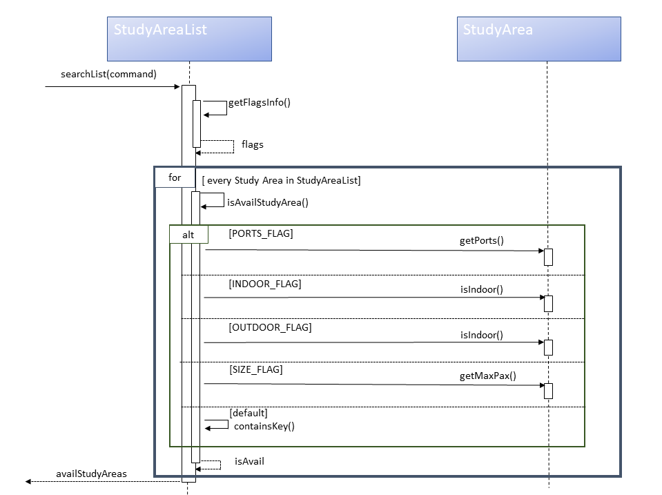

  
# Developer Guide    
 ## Design & Implementation    
 {Describe the design and implementation of the product. Use UML diagrams and short code snippets where applicable.}    
## 1.1 Architecture  
  
The architecture diagram shown above gives a overview of the various components used.  
  
## 1.2 Task Component  
  
The Task component depends on 3 other components,  
  
 1. Command Component - The Command component issues instructions for the Task component to execute based on the user's input. 
 
 2. UI Component - The UI component is used to display the results (and related exceptions) of the commands issued to the Task Component.
 
 3. ResourceLoader Component - The ResourceLoader component is used to load the list of tasks stored perviously when the application is started and is also used to store the current list of tasks to the local storage upon exit.  

  
  
The task component contains 8 separate classes. They are as follows:  
 
  1. Task : Abstract class used to model a generic task.
   
  2. Event : Specialized task class used to model events. 
  
  3. Deadline : Specialized task class used to model a deadline.  
   
  4. TaskType : Enumeration class used to denote the various task types.  
  
  5. TaskList : Container class used to store list of tasks and handle related operations.
   
  6. SchedulableTask : Class used to model a task which is scheduled based on user's requirements. 
  
  7. TaskComparator : Contains a custom comparator used to compare two schedulable tasks based on their 
  numberOfDaysLeft attribute. 
  
  8.  TaskScheduler : Class used to check for feasibility and schedule a list of tasks based on user's requirements.    
 
 ## 1.3 Study Area Component  
   
 The Study Area component depends on 3 other components,  
   
  1. Command Component - The Command component issues instructions for the Study Area component to execute based on the 
  user's input. 
  
  2. UI Component - The UI component is used to display the results (and related exceptions) of the commands issued to 
  the Study Area Component.
  
  3. ResourceLoader Component - The ResourceLoader component is used to load data of all existing Study Areas in NUS 
  into text files when the User first run the software. Eventually, data will be referred from the created text file.   
  
   
   
 The Study Area component contains 3 separate classes. They are as follows:  
  
   1. Dictionary : Class to map user input to specific terms used in StudyAreaList.
    
   2. StudyArea : Class that is used to model Study Areas. 
   
   3. StudyAreaList : Class that handles the list of available study areas based on User input.  
        
  
 ## 2.1 Scheduling Tasks
 ### 2.1.1 Implementation
 Inorder to schedule tasks based on the user's requirement a sepaarate SchedulableTask class was created.
 The user's requirements (Name, Time to complete it, Deadline) are captured for each of the tasks to be scheduled.
 The requirements captured are stored in the SchedulableTask object.
 Then, the TaskScheduler finds the optimum schedule based on the user's requirements using the EDF 
 (Early Deadline First) algorithm. Since, EDF is an optimum algorithm, if it can't find a valid schedule it means that 
 it's impossible to find a valid schedule based on the user's requirement. If a feasible schedule is found it is 
 displayed, else a message stating that a schedule based on the user's  requirements can't be made is displayed.
 
### 2.1.2 Alternatives
Aspect : How to capture user's requirements

 - Alternative 1 (Current Choice) : Create a separate SchedulableTask object to store user's requirements for each task 
 to be scheduled
	  - Pros : New class object can be customised without affecting core functionality if the attributes provided by 
	  the user changes
	  - Cons : New methods similar to previously implemented methods have to be created instead of being reused.
  - Alternative 2 : Modify existing event or deadline class to model user's requirements
	  - Pros : Led to reuse of methods and reduce coupling between classes in the TaskComponent.
	  - Cons : Major changes would be required throughout various components to accommodate the new feature. 

Finally the first alternative was implemented as it was easier to implement and maintain it if changes were required to 
the user's requirements (e.g. Changes to the number of parameters provided by the user).

## 2.2 Listing Study Areas 
### 2.2.1 Implementation 
The study area search is facilitated by StudyAreaList. In this class, it has the list of all existing study areas, 
stored internally as an ArrayList. This ArrayList is called studyAreaList. 

To list the study area, we iterate through the entire list of all existing study area and conduct a check. The check is 
as follows :

If in each study area, the study area meets all the flags stated by the User, the study area is then added to the 
list of available study area. If not, the iteration is skipped and move on to the subsequent study area.

To do as mentioned above, the StudyAreaList class implements the following main methods :

- searchList() : 
    - This method will iterate through all the study areas in the ArrayList studyAreaList while calling other methods 
    to carry out the search. Once process has ended, the method will return a list of the Study Area, availStudyArea, 
    that meets the User requirement.
- getFlagsInfo() : 
    - This method will retrieve the flags entered by User, at the same time validating the User input. The criteria 
    entered by the User will be returned as flags, an Array of Strings of fixed size 5 as the software only supports 5 
    flags in version 2.
- isAvailStudyArea() : 
    - This method does the check mentioned above and returns a boolean value. Based on the flags detected, 
    the method will iterate through the flags array and check if the Study Area's attribute matches each flag stated in
    flags. If isAvailStudyArea returns as true for all flags, the Study Area is then added to the output list, 
    availStudyArea. 

Below would be a sequence diagram to demonstrate how the search algorithm is operated.

  

### 2.2.2 Alternative 
Aspect: How to search based on User input.

- Alternative 1 (Current Choice) :
 
    Iterate through the list of all existing Study Areas. Then check if each Study Area 
meets User's Criteria
    - Pros : Lesser data structures required. Therefore lesser memory required.
    - Cons : Linear search, therefore, with bigger size of data, search may take longer. 
    
- Alternative 2 : 
    
    Create adjacency lists based on Study Area attributes. If the Study Area contains that attribute, the 
Study Area is added in that specific attribute list. The creation and initialisation of attribute lists are done when
the software is setting up. For example : Locations -> Study Area. Therefore, each attribute has its own list. Based on
user criteria, concatenate the output list with the study areas in the related attribute list. If more than one 
requirement is entered by the user, only the study areas appears in all the related attributes specified by the User 
will be added to the output list.
    - Pros : Data is categorised base on attributes
    - Cons : More memory is required as more data structures are used. Since methods invoked during the search are also 
    linear, time taken to complete the search will be longer if more data are present. Overall, this approach is harder 
    to implement.
  
Therefore, the first alternative is chosen, as it is easier to implement and lesser memory is used while 
conducting the search.

##  Product Scope 
### Target user profile    
  Our target users are mainly NUS students. Albeit, professors can use the Study Area feature to find a suitable spot to
  carry consultation, should they require one.  

### Value proposition    
 {Describe the value proposition: what problem does it solve?}    
    
## User Stories    
 |Version| As a ... | I want to ... | So that I can ...| 

|--------|----------|---------------|------------------|
|v1.0|new user|see list of commands supported|refer to them when I forget how to use the application|  
|v1.0|user|add a new task|keep track of it|  
|v1.0|user|edit a task|change it's details if required| 
|v1.0|user|delete a task|remove tasks that are cancelled| 
|v1.0|user|view my list of tasks sorted based on their date|be aware of all the tasks that are due/happening soon|  
|v1.0|user|view my list of tasks sorted based on their priority|be aware of the more important tasks|  
|v1.0|user|find a task by name|locate a task without having to go through the entire list|    
|v1.0|student|find a study area based on location and environment|have a conducive space to study|
|v1.0|professor|locate a study area that is outdoors| conduct consultations without worrying of making noise|

 ## Non-Functional Requirements    
 {Give non-functional requirements}    
    
## Glossary    

 * *flag* - criteria that is supported by the software. Currently supported flags are, -i for indoors, -o for outdoors,
 -p for Study Areas with ports and -s for the number of people that the Study Area should facilitate. 
 * *available Study Area* - Study Areas that matches the User requirement, therefore _available_ for usage.

## Instructions for Manual Testing    
 {Give instructions on how to do a manual product testing e.g., how to load sample data to be used for testing}