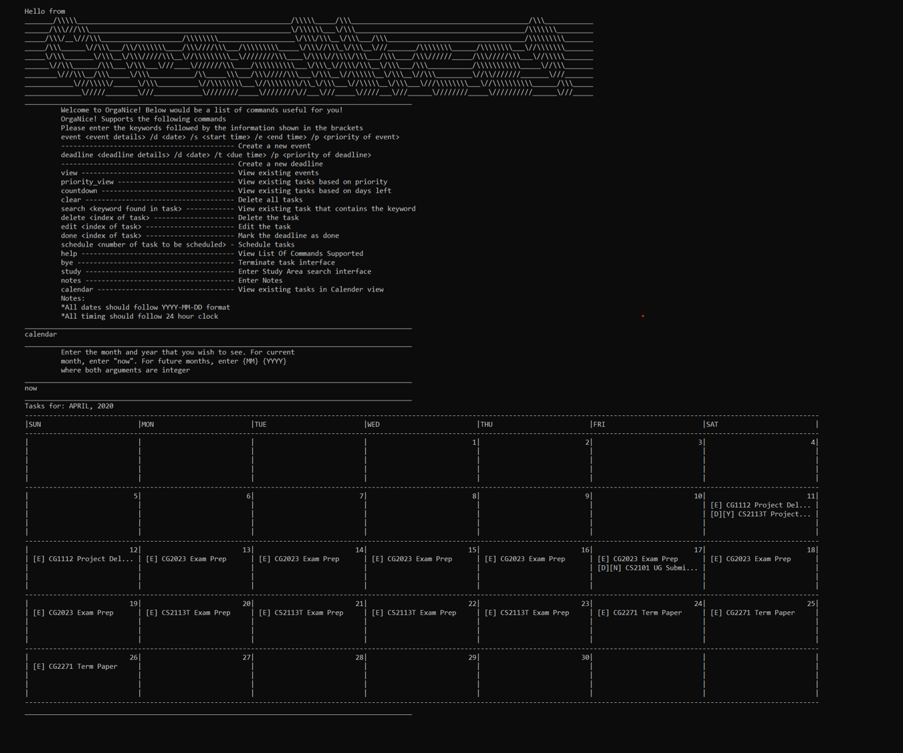

[comment]: # (@@author NizarMohd)
<!-- top button was extracted from https://www.w3schools.com/howto/howto_js_scroll_to_top.asp -->

<button onclick="topFunction()" id="topButton" title="Go to top">Top</button>

# OrgaNice!

  OrgaNice! is a task manager integrated with a Study Area search function and a Notes Taking feature. 
  You can use it to manage your tasks, be it events or deadlines. On top of that, 
  it is capable of assisting students in finding Study Areas that meet their desired criteria.
  Also, our Notes Taking feature provides you with a handy way to record notes based on school modules fast. 

Useful links:
* [User Guide](UserGuide.md)
* [Developer Guide](DeveloperGuide.md)
* [About Us](AboutUs.md)
