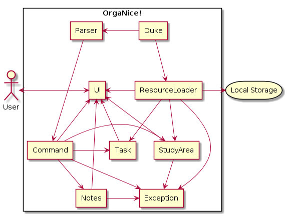
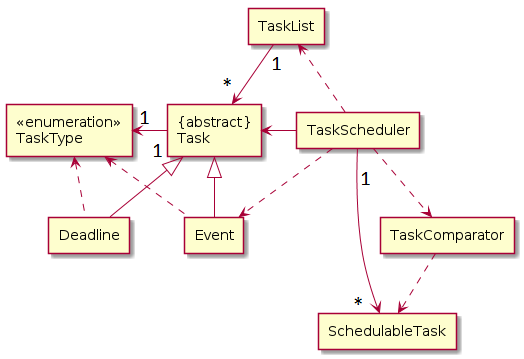
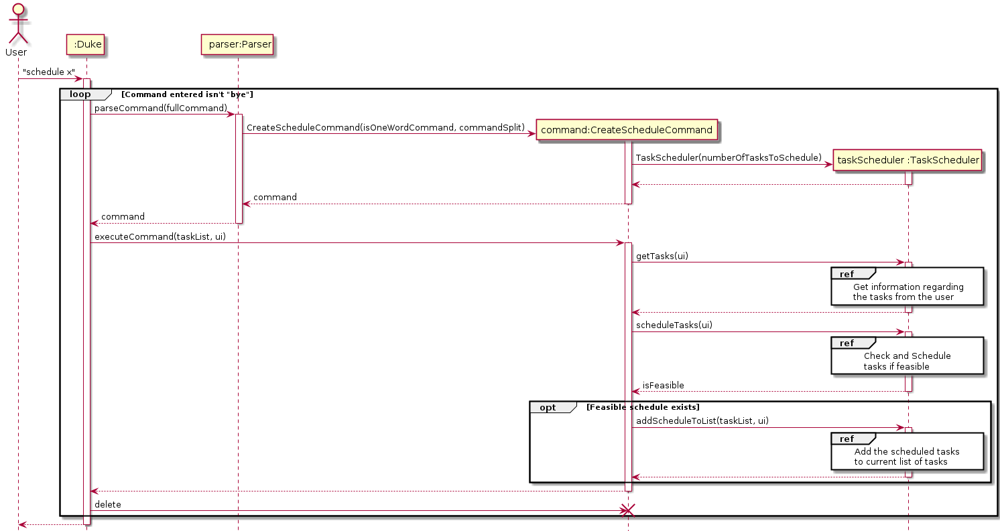
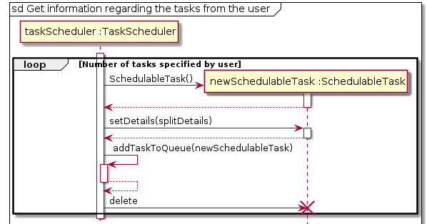
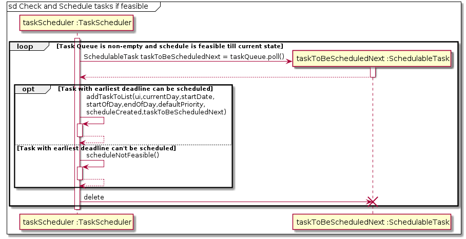
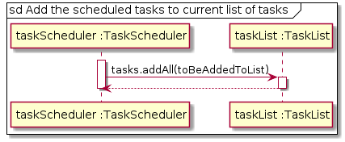

[comment]: # (@@author GanapathySanathBalaji)

<H1> GanapathySanathBalaji - Project Portfolio </H1>
  
# Project: OrgaNice!

##  Overview

  OrgaNice! is a command line based application that can help academics with scheduling their tasks and keeping track of them. It also has additonal features such as note taking and finding study areas within NUS, to help academics.

## Summary of Contributions

### Code Contributed
Link : [RepoSense Dashboard](https://nus-cs2113-ay1920s2.github.io/tp-dashboard/#=undefined&search=ganapathysanathbalaji)

### Enhancements implemented:
* **Major Enhancement:**  added the ability to **auto schedule** tasks based on the user's requirements
	* What it does: It allows the user to auto generate a schedule based on their requirements and add it to the list of tasks tracked by the application for later usage.
	* Justification: This feature improves the product significantly as a user can now automate the process of schedule creation, which might be hard to do manually for a large number of tasks.
	* Highlights: This feature couldn't use the task class used to store generic tasks. Also, modifying it to make it suitable for this feature would have complicated our previous code in a lot of places. Hence, implementation was a bit challenging as the new objects created had to be designed to be able to easily interact with pre-existing classes. The implementation of the algorithm was a bit challenging too.
	* Credits: The EDF (Earliest Deadline First) algorithm was used to implement the task scheduler. The current implementation doesn't support task pre-emption and hence the tasks are run to completion, before the other tasks get a chance to run.
* **Major Enhancement:**  added support for prioritized tasks and the ability to view tasks sorted by their priority
	* What it does: It allows user's to assign priority based on a task's importance when it is created. To provide flexibility, we allow the user to provide any integer value for the priority field. The user can also view tasks sorted based on their priorities.
	* Justification: This feature improves the product significantly as a user can now view the important tasks first and finish them before moving on to the less important tasks.
	* Highlights: Since, this was a feature which was implemented at the very begining, the implementation wasn't hard. However, this increased the complexity of code written based on this feature.
* **Minor Enhancement:** added a feature that allows the user to view the list of tasks sorted based on the date's along with the number of days left.
* **Minor Enhancement:** added a feature that allows the user to edit the details of various tasks directly which saves the user from manually deleting and adding a new task.
* **Contributions to documentation:**
	*  Documented the majority of the features (3.1 to 3.12, 3.15 to 3.17).
	* Documented the command summary for the main features of OrgaNice!.
	* Documented the various formats (for time, date) used for commands (Formats Used section).
* **Contributions to the DG:**
	*  Documented the architecture section, Task component and made their respective UML diagrams.
	* Documented the implementation for scheduling tasks, along with one main sequence diagram and three sub diagrams used as reference frames in the main diagram.
	* Documented a few user stories.
* **Contributions to  team-based tasks :**
	* Managed the release of v1.0 and v2.0.
	* Refactored code and created separate parser and command classes.
	* Added user stories to the DG.
	* Maintained the issue tracker for a significant amount of time and handled all the issues/bugs raised during the PE-Dry run.
* **Review/mentoring contributions:**
	* Reviewed the following PR's: 
		[#133](https://github.com/AY1920S2-CS2113T-T12-3/tp/pull/133), [#127](https://github.com/AY1920S2-CS2113T-T12-3/tp/pull/127), [#124](https://github.com/AY1920S2-CS2113T-T12-3/tp/pull/124), [#117](https://github.com/AY1920S2-CS2113T-T12-3/tp/pull/117), [#112](https://github.com/AY1920S2-CS2113T-T12-3/tp/pull/112), [#95](https://github.com/AY1920S2-CS2113T-T12-3/tp/pull/95), [#67](https://github.com/AY1920S2-CS2113T-T12-3/tp/pull/67), [#65](https://github.com/AY1920S2-CS2113T-T12-3/tp/pull/65), [#41](https://github.com/AY1920S2-CS2113T-T12-3/tp/pull/41)
	* Helped team by changing the runtest.bat and runtest.sh files to decrease the number of steps required to run the tests.
* **Contributions beyond the project team:**
	* I posted one response to [Issue#21](https://github.com/nus-cs2113-AY1920S2/forum/issues/21) on the main forum.
	* Reported 19 bugs during the [PE Dry Run](https://github.com/GanapathySanathBalaji/ped/issues).
* **Contributions to the User Guide (Extracts)**:

		The sections I contributed to in the user guide are as follows.
	    Due to recommended page limit not all sections contributed by 
	    me have been shown below.
	    They showcase my ability to write documentation targeting end-users.

### 3.12. Schedule tasks
If you have a bunch of assignments, projects and exams happening over the next few weeks and are stressed out with 
planning a schedule which can fulfill the requirements, our schedule task command can help you by creating a feasible 
schedule. It creates a schedule based on the tasks details provided by you. 

#### Usage

#### `schedule <number of task to be scheduled>` - Used to schedule a set of tasks specified by the user 

Then a set of lines are displayed which specify the format to be used to specify the new tasks to be scheduled. After you input the relevant data. The application would find a feasible schedule satisfying your constraints, if it is possible to do so. If it is possible, the list of events that were created when the task were scheduled is added to the current list of tasks. If it is impossible, a message to alert the user is specified too.
If the wrong format is used an invalid command alert would be displayed.

Example of usage: 

#### `schedule 3` - Schedule 3 tasks

Expected outcome:

    ________________________________________________________________________________________________
         Enter tasks in the following format:
         <task name> /f <Time to finish task in days> /d <Number of
         days left from current day to finish it>
         Enter details for task 1:

#### `math exam /f 2 /d 10` - Details of first task

Expected outcome:

	 Enter details for task 2:
     
#### `physics exam /f 3 /d 7` - Details of second task

Expected outcome:

	 Enter details for task 3:
     
#### `chemistry exam /f 1 /d 4` - Details of third task     

Expected outcome:

         Details captured successfully.
         chemistry exam is scheduled from 2020-03-27 to
         2020-03-27
         physics exam is scheduled from 2020-03-28 to
         2020-03-30
         math exam is scheduled from 2020-03-31 to
         2020-04-01
         Tasks successfully scheduled.
    ________________________________________________________________________________________________
    
#### Future Enhancements
   The current version of the application doesn't take into account the other tasks present, however the priority 
values can still be used to decide the task which is more important. In v3.0 our application will support scheduling tasks 
while avoiding tasks present previously and also add support for tasks to be scheduled preemptively (i.e, tasks can be 
scheduled over non contiguous days) .

 

## 6. Formats Used

Time should be in the form of `HH:MM` (24 Hour Format, HH - Hour, MM - Minute)  
Date should be in the form of `YYYY-MM-DD` (YYYY - Year, MM - Month, DD - Day)  

**Contributions to the Developer Guide (Extracts)**:

        I contributed to the following sections in the Developer Guide.
        Due to recommended page limit not all sections contributed by 
        me have been shown below.
        They showcase my ability to write technical documentation and
        the technical depth of my contributions to the project.

### 2.1. Architecture  
  

Figure 1. Overall Architecture of OrgaNice!

 

1. Duke - Main component which controls the flow of execution.

1. Ui - Component used to get input from the user and display results on the monitor.

1. Parser - Component used to abstract out the command based on user's input, so that the command can be executed later.

1. Command - Component contains information and implementation on how to execute various types of commands.

1. Task - Component contains details about handling the task list and related operations.

1. StudyArea - Component contains details about handling queries for study area search.

1. Notes - Component contains details about Notes related operations.

1. Exception - Component contains the various types of exceptions encountered when OrgaNice! is run.

1. ResourceLoader - Component handles loading and saving of the task list and study area details to local storage.

### 2.2. Task Component  
  

[comment]: # (@@author GanapathySanathBalaji)  
  
The Task component depends on 3 other components,   
  
 1. Command Component - The Command component issues instructions for the Task component to execute based on the user's input.  
 
 2. UI Component - The UI component is used to display the results (and related exceptions) of the commands issued to the Task Component. 
 
 3. ResourceLoader Component - The ResourceLoader component is used to load the list of tasks stored previously when the application is started and is also used to store the current list of tasks to the local storage upon exit.   

   

Figure 2. Object Diagram for Task Component

 
The task component contains 8 separate classes. They are as follows:  
 
  1. Task : Abstract class used to model a generic task. 
   
  2. Event : Specialized task class used to model events.  
  
  3. Deadline : Specialized task class used to model a deadline.   
   
  4. TaskType : Enumeration class used to denote the various task types.   
  
  5. TaskList : Container class used to store list of tasks and handle related operations. 
   
  6. SchedulableTask : Class used to model a task which is scheduled based on user's requirements.  
  
  7. TaskComparator : Contains a custom comparator used to compare two schedulable tasks based on their 
  numberOfDaysLeft attribute.  
  
  8.  TaskScheduler : Class used to check for feasibility and schedule a list of tasks based on user's requirements.

## 3. Implementation

### 3.1. Scheduling Tasks 

#### 3.1.1 Implementation 
   Inorder to schedule tasks based on the user's requirement a separate SchedulableTask class was created. 
 1. The user's requirements (Name, Time to complete it, Deadline) are captured for each of the tasks to be scheduled. 
 1. The requirements captured are stored in the SchedulableTask object. 
 1. Then, the TaskScheduler object finds the optimum schedule based on the user's requirements using the EDF 
 (Early Deadline First) algorithm.
 1. If a feasible schedule is found it is 
 displayed, else a message stating that a schedule based on the user's requirements can't be made is displayed.
 
	
   The following sequence diagrams explain how tasks are scheduled.
	
 

Figure 5. Overall Sequence Diagram

 
 The three reference frames used are as follows:

 * `Get information regarding the tasks from the user`

 
 
Figure 6. Sub Diagram 1

  
 * `Check and Schedule tasks if feasible`

 
 
Figure 7. Sub Diagram 2

  
 * `Add the scheduled tasks to current list of tasks`
 
 
 
Figure 8. Sub Diagram 3

   
 
#### 3.1.2 Alternatives
Aspect : How to capture user's requirements and handle it.

 - Alternative 1 (Current Choice) : Create a separate SchedulableTask object to store user's requirements for each task 
                                    to be scheduled.
      - Pros : New class object can be customised without affecting core functionality of the product if the attributes provided by 
      the user (to tasks to be scheduled) changes.
      - Cons : New methods similar to previously implemented methods have to be created instead of being reused.
      
 - Alternative 2 : Modify existing event or deadline class to model user's requirements.
      - Pros : It reuses methods and reduces coupling between classes in the TaskComponent.
      - Cons : Major changes would be required throughout various components of the application to accommodate the new feature. 

     Finally the first alternative was implemented as it was easier to implement and maintain it if changes were required to 
the user's requirements (e.g. Changes to the number of parameters provided by the user).