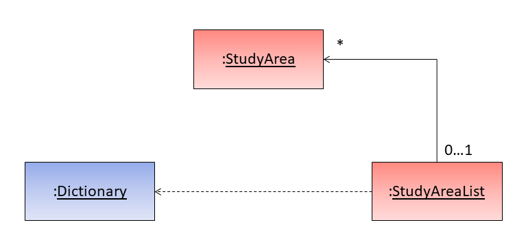
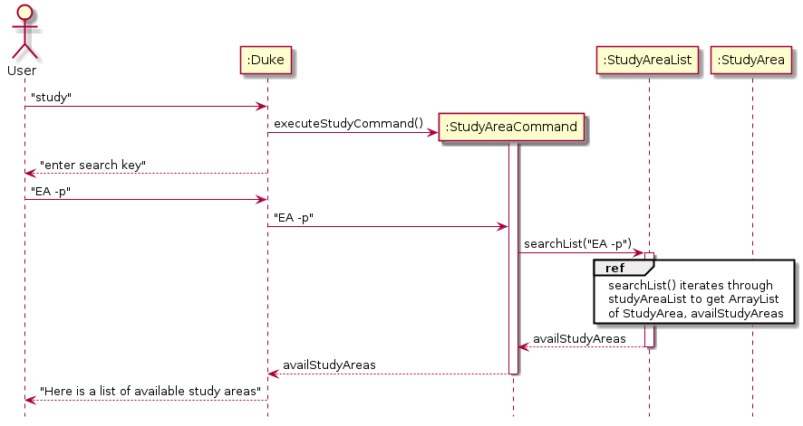
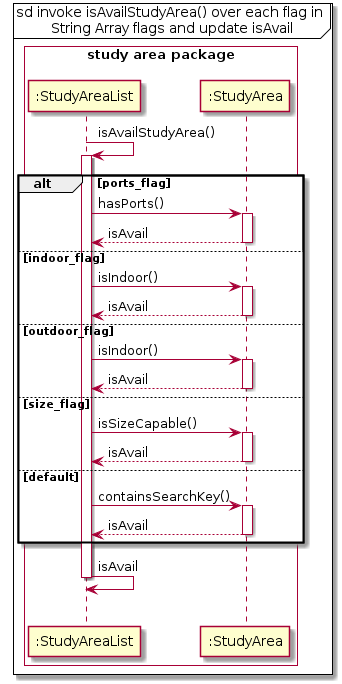
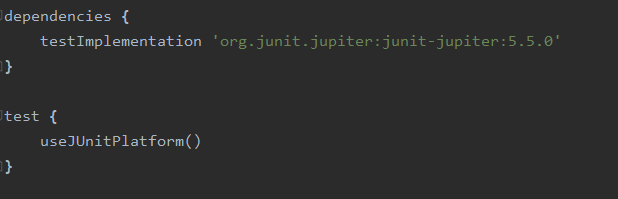
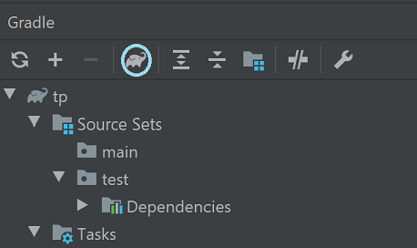
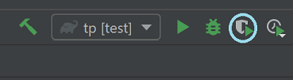

[comment]: # (@@author NizarMohd)
<!-- top button was extracted from https://www.w3schools.com/howto/howto_js_scroll_to_top.asp -->

<button onclick="topFunction()" id="topButton" title="Go to top">Top</button>

<a href="https://ay1920s2-cs2113t-t12-3.github.io/tp/" class="backlink">Back to OrgaNice!'s main page</a>

# Nizar Mohd - Project Portfolio Page

# Project: OrgaNice!

##  Overview

  OrgaNice! is a command line based application that can help academics with scheduling their tasks and keeping track of them. 
  It also has additional features such as note taking and finding study areas within NUS, to help academics.

## Summary of Contributions

### Code Contributed
Link : [RepoSense Dashboard](https://nus-cs2113-ay1920s2.github.io/tp-dashboard/#search=&sort=totalCommits%20dsc&sortWithin=totalCommits%20dsc&timeframe=commit&mergegroup=false&groupSelect=groupByRepos&breakdown=false&tabOpen=true&tabType=authorship&tabAuthor=NizarMohd&tabRepo=AY1920S2-CS2113T-T12-3%2Ftp%5Bmaster%5D)

### Enhancements implemented:
* **Major Enhancement:**  added the ability to search for study areas based on User's criteria.
	* What it does: It allows user to obtain a list of study areas that meets the criteria entered by the user. Supported criteria includes name, address, faculty, port availability, environment and capacity.
	* Justification: This feature forms one of the intended features of OrgaNice and it gives Students the awareness on actual study areas that they can use to study, if they are new to the faculty or just unfamiliar with NUS. 
	* Highlights: This feature supports lose search when searching by name, address or faculty. Meaning user can enter commonly used abbreviations for locations and still return a result. For example, Starbucks is commonly known as bux or bucks in the current era, and allowing the user to search with the commonly used abbreviations allows for ease of use on the user end. This utilised HashMap to create a mapping between the commonly used abbreviations to the actual attributes of the locations stored in our data files.
	* Credits: The algorithm currently used was suggested by one of our Team Member, Terry. He gave me a verbal idea of the algorithm which allowed me to implement it into code. 
* **Major Enhancement:**  added the ability to view Tasks in calendar view.
	* What it does: Allows user to take a glance on the list of tasks available in a month period (specified by the User).
	* Justification: This feature improves the product visually, and gives the User ease of access and visibility of the task they have for an entire month.
	* Highlights: The user can view the tasks for any month that they desire, present or future only. The difficulty comes when we have to print the day of the month at the correct boxes and according to the actual day of the week. Next was to print the content such that it does not cause any mismatch in the alignment of Calendar view. Therefore, we only decided to print a maximum of four tasks per day with each tasks detail not exceeding 25 characters. Any details that exceed will have its last three characters (of the 25) displayed as ellipses.
* **Minor Enhancement:** added the ability to mark deadlines as done, by extension, adding a boolean attribute, isDone, to Deadline class.
* **Minor Enhancement:** added the ability to print messages in a specific format, which is with indentation and of a fixed length.
    * Credits: The implementation of the code was extracted from [stackOverflow](https://stackoverflow.com/questions/7528045/large-string-split-into-lines-with-maximum-length-in-java)
* **Contributions to [UG](#contributions-to-user-guide-extract)**
	* Documented the for features (3.13 & 3.15)
	* Added some details for FAQ (Q1 , 3 & 5)
* **Contributions to the [DG](#contributions-to-the-developers-guide-extracts)**
    * Documented Table of Contents, styling of images using css and numbering of figures.
	* Documented the Study Area Component. This includes the documentation of the Object Diagram for the Study Area Component.
	* Documented the implementation for study area search feature and the Sequence Diagram to show the implementation.
	* Documented Non-Functional Requirements.
	* Documented Glossary.
	* Documented Testing.
* **Contributions to team-based tasks :**
	* Assisted with integration of the forking workflow during the earlier stage, as there were mismatch after resolving merge conflicts.
	* Refactored code by removing some of the magic literals into constants and moving constants into its own class, Constant class. 
	* Assisted with the Ui of the system by integrating Ui to classes that requires communication with the user.
	* Obtained the design for logo and goodbye dab. Credits: [Generator for logo](http://patorjk.com/software/taag/#p=display&f=Graffiti&t=TypeSomething), [image source for goodbye dab](https://www.netclipart.com/isee/iRwmhJb_bt21-rj-transparent-background/), [generator for goodbye dab](https://asciiart.club/)
    * Added test cases using JUnit for study area command, calendar view and study area list.
* **Review/mentoring contributions:**
	* Reviewed the following PR's: 
		[#75](https://github.com/AY1920S2-CS2113T-T12-3/tp/pull/75) [#125](https://github.com/AY1920S2-CS2113T-T12-3/tp/pull/125)
* **Contributions beyond the project team:**
	* Reported 6 bugs during the [PE Dry Run](https://github.com/NizarMohd/ped/issues).
	* Reviewed another team's [DG](https://github.com/nus-cs2113-AY1920S2/tp/pull/28#pullrequestreview-384379913)
	
	

### Contributions to User Guide (Extract)

This section is extracted to show a sample documentation that I have done for the User Guide.

 

### 3.13 Study Area Search Feature

You can search for study areas based on criteria that you desire by using this feature. You are free to loosely search. 
For example, if you enter as [this](#search-by-name-address-or-faculty), you will receive a list of  places related 
to the name *Starbucks* as "bux" is a common abbreviation used for it.

#### 3.13.1 Entering Study Area Search Interface

To enter the Study Area search interface, you can enter 'study' in the main interface. You will then be 
guided to the study area search interface. 

#### Usage

Example of usage: 
`study`

Expected Outcome:

    ________________________________________________________________________________________________
         Please enter the location for your desired study area.
         Enter "help" for a list of supported flags. Flags should
         only come after location, if a criteria for location is
         entered. When you are done with the search, enter "bye".
    ________________________________________________________________________________________________

#### 3.13.2 Start Search

You can start the search by entering the criteria desired. Supported criteria include name, address, faculty,
ports availability, environment and size capacity. For  name, address or faculty, you simply have to enter it
as a string. For other supported conditions, flags have to be used. 

Below are the supported flags: 
   * -s {size}  : To locate a study area that can facilitate the size of pax entered.
   * -p         : To locate a study area based on the availability of ports.
   * -i         : To locate a study area that are indoors.
   * -o         : To locate a study area that are outdoors.

Note: 

{name\address\faculty} {flags} is the basic format to search for Study Areas. You can enter either argument, or both.
If both arguments are specified, flags will have to precede either the name,address or faculty.

#### Usage

#### Search by name, address or faculty 

Example of usage:
`bux`

Expected Outcome:

    ________________________________________________________________________________________________
         Here are the available study areas!
         __________________________________________________________
         Name: Opposite Town Green (Outside Starbucks)
         Address: 2 College Avenue West Education Resource Centre,
         Ground Level
         Faculty: Utown
         Port: true
         Indoor: false
         Maximum number of Pax: 4
         __________________________________________________________
         __________________________________________________________
         Name: Starbucks
         Address: 2 College Avenue West Education Resource Centre,
         Ground Level
         Faculty: Utown
         Port: true
         Indoor: true
         Maximum number of Pax: 5
         __________________________________________________________
         Please enter the location for your desired study area.
    ________________________________________________________________________________________________

#### Search by name, address or faculty and with flags

Example of usage:
`bux -o`

Expected Outcome:

    ________________________________________________________________________________________________
         Here are the available study areas!
         __________________________________________________________
         Name: Opposite Town Green (Outside Starbucks)
         Address: 2 College Avenue West Education Resource Centre,
         Ground Level
         Faculty: Utown
         Port: true
         Indoor: false
         Maximum number of Pax: 4
         __________________________________________________________
         Please enter the location for your desired study area.
    ________________________________________________________________________________________________

__NOTE__: When using this format, flags must always come after the location, name or address. Else, the system will 
return an error message.

### Search by flags only 

Example of usage : 
`-s 6`

Expected output:

    ________________________________________________________________________________________________
         Here are the available study areas!
         __________________________________________________________
         Name: EA Level 4
         Address: 9 Engineering Drive 1,EA, Level 4, Outside Staff
         Offices
         Faculty: Engineering
         Port: true
         Indoor: false
         Maximum number of Pax: 6
         __________________________________________________________
         Please enter the location for your desired study area.
    ________________________________________________________________________________________________

#### Future Enhancements

   The current implementation does not include real-time availability of the study areas. In version 3.0 we hope to be
   able to retrieve real-time availability of public study areas, like the ones in U-Town. In order to do so we would 
   require access to real-time data like CCTV monitors of the study areas to detect if there is an available seat at 
   a specific point of time at a specific area. Also, due to time constraint, we were not able to gather an exhaustive 
   list for the study area. At version 3.0 we aim to reach full breadth for the data on study areas in NUS.

### 3.15. Calendar View

#### 3.15.1. Enter Calendar
Example of usage:

`calendar`

Expected output: 

    ________________________________________________________________________________________________
         Enter the month and year that you wish to see:
    ________________________________________________________________________________________________

#### 3.15.2. Enter Desired Month to View

#### To view tasks for current month
Example of usage:
 
`now`

Expected output:

    ________________________________________________________________________________________________
    Tasks for: APRIL, 2020
    -----------------------------------------------------------------------------------------------------------------------------------------------------------------------------------------------------
    |SUN                        |MON                        |TUE                        |WED                        |THU                        |FRI                        |SAT                        |
    -----------------------------------------------------------------------------------------------------------------------------------------------------------------------------------------------------
    |                           |                           |                           |                          1|                          2|                          3|                          4|
    |                           |                           |                           |                           |                           |                           |                           |
    |                           |                           |                           |                           |                           |                           |                           |
    |                           |                           |                           |                           |                           |                           |                           |
    |                           |                           |                           |                           |                           |                           |                           |
    -----------------------------------------------------------------------------------------------------------------------------------------------------------------------------------------------------
    |                          5|                          6|                          7|                          8|                          9|                         10|                         11|
    |                           |                           |                           |                           |                           |                           |                           |
    |                           |                           |                           |                           |                           |                           |                           |
    |                           |                           |                           |                           |                           |                           |                           |
    |                           |                           |                           |                           |                           |                           |                           |
    -----------------------------------------------------------------------------------------------------------------------------------------------------------------------------------------------------
    |                         12|                         13|                         14|                         15|                         16|                         17|                         18|
    |                           |                           |                           |                           |                           |                           | [D][N] submit cg2028 r... |
    |                           |                           |                           |                           |                           |                           |                           |
    |                           |                           |                           |                           |                           |                           |                           |
    |                           |                           |                           |                           |                           |                           |                           |
    -----------------------------------------------------------------------------------------------------------------------------------------------------------------------------------------------------
    |                         19|                         20|                         21|                         22|                         23|                         24|                         25|
    |                           |                           |                           |                           |                           |                           |                           |
    |                           |                           |                           |                           |                           |                           |                           |
    |                           |                           |                           |                           |                           |                           |                           |
    |                           |                           |                           |                           |                           |                           |                           |
    -----------------------------------------------------------------------------------------------------------------------------------------------------------------------------------------------------
    |                         26|                         27|                         28|                         29|                         30|                           |                           |
    |                           |                           |                           |                           |                           |                           |                           |
    |                           |                           |                           |                           |                           |                           |                           |
    |                           |                           |                           |                           |                           |                           |                           |
    |                           |                           |                           |                           |                           |                           |                           |
    -----------------------------------------------------------------------------------------------------------------------------------------------------------------------------------------------------
    ________________________________________________________________________________________________

#### To view tasks for future months

*NOTE*:  
1. Input for both month and year must be integers. 
1. This feature only supports the current and future months. 
1. Any details that exceed the limit within the designated box for the day, will have the last three displayed characters as ellipses.

Example of usage: 

`5 2020`

Expected output:

    ________________________________________________________________________________________________
    Tasks for: MAY, 2020
    -----------------------------------------------------------------------------------------------------------------------------------------------------------------------------------------------------
    |SUN                        |MON                        |TUE                        |WED                        |THU                        |FRI                        |SAT                        |
    -----------------------------------------------------------------------------------------------------------------------------------------------------------------------------------------------------
    |                         31|                           |                           |                           |                           |                          1|                          2|
    |                           |                           |                           |                           |                           |                           | [E] cs2113 final exam     |
    |                           |                           |                           |                           |                           |                           |                           |
    |                           |                           |                           |                           |                           |                           |                           |
    |                           |                           |                           |                           |                           |                           |                           |
    -----------------------------------------------------------------------------------------------------------------------------------------------------------------------------------------------------
    |                          3|                          4|                          5|                          6|                          7|                          8|                          9|
    |                           | [D][N] math assignment    |                           |                           |                           |                           |                           |
    |                           | [D][N] physics assignm... |                           |                           |                           |                           |                           |
    |                           |                           |                           |                           |                           |                           |                           |
    |                           |                           |                           |                           |                           |                           |                           |
    -----------------------------------------------------------------------------------------------------------------------------------------------------------------------------------------------------
    |                         10|                         11|                         12|                         13|                         14|                         15|                         16|
    |                           |                           |                           |                           |                           |                           |                           |
    |                           |                           |                           |                           |                           |                           |                           |
    |                           |                           |                           |                           |                           |                           |                           |
    |                           |                           |                           |                           |                           |                           |                           |
    -----------------------------------------------------------------------------------------------------------------------------------------------------------------------------------------------------
    |                         17|                         18|                         19|                         20|                         21|                         22|                         23|
    |                           |                           |                           |                           |                           |                           |                           |
    |                           |                           |                           |                           |                           |                           |                           |
    |                           |                           |                           |                           |                           |                           |                           |
    |                           |                           |                           |                           |                           |                           |                           |
    -----------------------------------------------------------------------------------------------------------------------------------------------------------------------------------------------------
    |                         24|                         25|                         26|                         27|                         28|                         29|                         30|
    |                           |                           |                           |                           |                           |                           |                           |
    |                           |                           |                           |                           |                           |                           |                           |
    |                           |                           |                           |                           |                           |                           |                           |
    |                           |                           |                           |                           |                           |                           |                           |
    -----------------------------------------------------------------------------------------------------------------------------------------------------------------------------------------------------
    ________________________________________________________________________________________________

#### 3.15.3 To escape from Calendar View Command 

In any case that you wish not to exit calendar mode after entering it, you can enter "bye" to exit.

Example of usage: 

`bye`

Expected output:

    ________________________________________________________________________________________________
         You are now back in main interface. Enter "help" for a
         list of supported commands
    ________________________________________________________________________________________________

### Contributions to the Developer's Guide (Extracts):

The sections I contributed to in the Developer's Guide are as follows.
Note that the content below just shows an extract of the documentation I have done.
The purpose of the extract is to show my documentation capability.

### Extract 1 (Class Diagram)

### 2.3. Study Area Component  
 
### 2.3. Study Area Component  
   
 The Study Area component depends on 3 other components,  
   
  1. Command Component - The Command component issues instructions for the Study Area component to execute based on the 
  user's input. 
  
  2. UI Component - The UI component is used to display the results (and related exceptions) of the commands issued to 
  the Study Area Component.
  
  3. ResourceLoader Component - The ResourceLoader component is used to load data of all existing Study Areas in NUS 
  into text files when the User first run the software. Eventually, data will be referred from the created text file.   
  
 

Figure 3. Class diagram for Study Area Component

 
 The Study Area component contains 3 separate classes. They are as follows:  
  
   1. Dictionary: Class to map user input to specific terms used in StudyAreaList. 
    
   2. StudyArea: Class that is used to model Study Areas. 
   
   3. StudyAreaList: Class that handles the list of available Study Areas based on User input.  

Details on the methods are listed in the [glossary](https://ay1920s2-cs2113t-t12-3.github.io/tp/DeveloperGuide.html#appendix-d-glossary)

### Extract 2 (Sequence Diagram)

### 3.2. Listing Study Areas 

#### 3.2.1 Implementation 
The Study Area search is facilitated by StudyAreaList. In this class, it has the list of all existing Study Areas, 
stored internally as an ArrayList. This ArrayList is called studyAreaList. 

To list the Study Area, we iterate through the entire list of all existing Study Area and conduct a check. The check is 
as follows :

If in each Study Area, the Study Area meets all the flags stated by the User, the Study Area is then added to the 
list of available Study Area. If not, the iteration is skipped and move on to the subsequent Study Area.

To do as mentioned above, the StudyAreaList class implements the following main methods :

- searchList() : 
    - This method will iterate through all the Study Areas in the ArrayList studyAreaList while calling other methods 
    to fulfil the search requirements. Once process has ended, the method will return a list of the Study Area, availStudyArea, 
    that meets the User requirement.
- getFlagsInfo() : 
    - This method will retrieve the flags entered by User, at the same time validating the User input. The criteria 
    entered by the User will be returned as flags, an Array of Strings of fixed size 5 as the software only supports 5 
    flags in version 2.
- isAvailStudyArea() : 
    - This method does the check mentioned above and returns a boolean value. Based on the flags detected, 
    the method will iterate through the flags array and check if the Study Area's attribute match each flag stated in
    flags. If isAvailStudyArea returns as true for all flags, the Study Area is then added to the output list, 
    availStudyArea. 

Below would be a sequence diagram to demonstrate how the search algorithm is operated.

 * `User enters search key` 
 
  

Figure 9. Interaction between User and Study Area Search Interface

 

 * `StudyAreaCommand invokes searchList() of StudyAreaList` 
 

Figure 10. Interaction within Study Area Search Interface

 

Figure 11. Interaction when isAvailStudyArea is invoked

 

You can refer [here](https://ay1920s2-cs2113t-t12-3.github.io/tp/DeveloperGuide.html#appendix-d-glossary) for a detailed explanation on the terms used in this diagram

#### 3.2.2 Alternative 
Aspect: How to search based on User input.

- Alternative 1 (Current Choice) :
 
    Iterate through the list of all existing Study Areas. Then check if each Study Area meets User's Criteria
    - Pros: Lesser data structures required. Therefore lesser memory required.
    - Cons: Linear search, therefore, with a bigger size of data, the search may take longer.  

    
- Alternative 2 : 

There exist four flags: port availability, indoor, outdoor, capacity. Create adjacency lists that map the flag to the 
Study Area itself. If the Study Area contains that attribute, the Study Area is added in that specific attribute list. 
Depending on the type of attribute, the adjacency list can be implemented using different data structures.

For example, let's take only the two study areas below as the entire data set.

Figure 12. Sample Data

 

This will result in the following adjacency lists : 

Environment: 

Indoor -> {Starbucks}  
Outdoor -> {Opposite Town Green (Outside Starbucks)} 

*Data Structure* : 2D Array, with only two rows (For indoors and outdoors)

Ports: 

Yes -> {Opposite Town Green (Outside Starbucks), Starbucks} 
No -> null

*Data Structure*: 2D Array, with only two rows (For Yes and No)

Capacity: 

4 -> {Opposite Town Green (Outside Starbucks)}  
5 -> {Starbucks} 

*Data Structure*: HashMap<Integer, ArrayList<String>> 

The creation and initialisation of the lists are done when the software is setting up.  Therefore, each flag 
has its designated list. Based on user criteria, concatenate an output list with the Study Areas that are found in all
of the relevant flag lists stated by the user. If more than one requirement is entered by the user, only the Study 
Areas appears in all the related attributes specified by the User will be added to the output list.

- Pros: Data is categorised based on flags.
- Cons: More memory is required as more data structures are used. Since methods invoked during the search are also 
linear, time taken to complete the search will be longer if more data are present. Overall, this approach is harder 
to implement.

Therefore, the first alternative is chosen, as it is much easier to implement and lesser memory is used while searching

### Extract 3 (General Documentation)

## 4. Testing 

Currently, we have two runners to execute the tests, JUnit and Gradle. 
*Note*: It is advisable to run tests with coverage, to ensure that 90% of the paths are covered.

#### Using IntelliJ JUnit

Firstly check if the configuration, "All in 'tp.test'" exist. You need to edit a configuration if there isn't any to run all tests. 

To edit a configuration, click `Run` then click on `Edit Configurations`. Proceed to click the `+` icon, followed by `JUnit`

Afterward, ensure that the configurations are as such:

Figure 13. Configuring JUnit Tests

 

To run all tests, right-click on the src/test/java folder and choose Run 'All in 'tp.tests'' with coverage
This allows for you to see which path has the test covered so that you can ensure at least 90% of the paths are covered when testing.

Alternatively, you can click on this icon to run with coverage :

Figure 14. Running JUnit Tests

 

To run a subset of tests, you can right-click on a test package, test class, or a test and choose Run with coverage.

#### Using Gradle

Firstly ensure that the Gradle build has the following details: 

Figure 15. Expected Gradle Build 

 

Next, to run using Gradle, you can click on the Gradle plugin icon at the left-hand side

Then click on the elephant icon (as seen below) and search for `Gradle test` then proceed to click on it.

Figure 16. Gradle Icon

 

Now the configuration is set to Gradle. Proceed to click the icon:

Figure 17. Running Gradle Test

 

