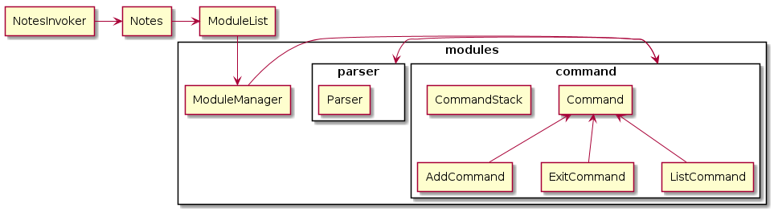

[comment]: # (@@author NizarMohd)
<!-- top button was extracted from https://www.w3schools.com/howto/howto_js_scroll_to_top.asp -->

<button onclick="topFunction()" id="topButton" title="Go to top">Top</button>

<a href="https://ay1920s2-cs2113t-t12-3.github.io/tp/" class="backlink">Back to OrgaNice!'s main page</a>

# Terry Tay - Project Portfolio Page

# Project: OrgaNice!

##  Overview

  OrgaNice! is a command line based application that can help academics with scheduling their tasks and keeping track of them. 
  It also has additional features such as note taking and finding study areas within NUS, to help academics.

## Summary of Contributions

### Code Contributed
Link : [RepoSense Dashboard](https://nus-cs2113-ay1920s2.github.io/tp-dashboard/#breakdown=true&search=terry%20tay&sort=groupTitle&sortWithin=title&since=2020-03-01&timeframe=commit&mergegroup=false&groupSelect=groupByRepos&tabOpen=true&tabType=authorship&tabAuthor=terrytay&tabRepo=AY1920S2-CS2113T-T12-3%2Ftp%5Bmaster%5D)

### Enhancements implemented:
* **Major Enhancement:**  added a uniform resource loader and runner for OrgaNice
	* What it does: It allows Task Scheduler and Study Area Feature to load the text file resources with high layer of abstraction.
  * Justification: This improves coherence in the code and allows developers on OrgaNice to have a better and easier experience.
  * Highlights: It was diffcult initially due to different demands from Task Scheduler and Study Area Feature respectively. However, after going through the lecture notes and understanding OOP better, I was able to provide this support with abstraction.
* **Major Enhancement:**  added the ability to undo and redo in Notes
	* What it does: In notes, typing undo will automatically remove the last note stored and typing redo will restore the last note removed.
  * Justification: This allows users to easier add and remove notes step by step without having to type "delete index" which is intuitively a better way.
  * Highlights: Using the Command pattern and Memento pattern in Notes was the main idea. To implement undo and redo, initially, I was stuck. I wanted to copy the whole text files and store it as a state but I knew it would be memory extensive. Searching online, I found a way to work with Memento pattern and finally got the undo and redo to work using two linked list which act as stack for insert and removal.
  * Credits: [Developer.com](https://www.developer.com/design*/article.php/3720566/Working-With-Design-Patterns-Memento.htm)
* **Minor Enhancement:** added Junit tests to ensure full coverage for Study Area Feature
* **Contributions to UG**
	* Documented the for features (3.14).
* **Contributions to the DG:**
  * Documented Design of Notes Component.
  * Documented Implementation of Notes Component.

* **Contributions to team-based tasks :**
  * Help to setup proper workflow environment for the team during the initial phase.
  * Assisted with team workflow by assuming a SCRUM master role in the initial stages before the entire team got familarised.
  * Ensured that quality of work and checking of work are done by team before merging.
  * Wrote test cases for beta stages of OrgaNice, some of which are not included, in the final source.
  
* **Review/mentoring contributions:**
	* Reviewed the following PR's: 
		[#44](https://github.com/AY1920S2-CS2113T-T12-3/tp/pull/44) [#13](https://github.com/AY1920S2-CS2113T-T12-3/tp/pull/13)
* **Contributions beyond the project team:**
	* Reviewed another team's [DG](https://github.com/nus-cs2113-AY1920S2/tp/pull/24)
	
	
### Contributions to the Developer's Guide (Extracts):

The below extractions showcase my capabilities as a software engineer and team player.

### Extract 1 (Object Diagram)

[comment]: # (@@author terrytay)

### 2.4. Notes Component

Figure 4. Object diagram for Notes Component

 
The Notes component is self-contained apart from calling UI class for Strings output.
  
Inside Notes component, there exists these classes:
  
1. NotesInvoker : Class to start the Notes
	
2. Notes : Class to support operations for the modules in the Notes, acts as interface.
	
3. Modulelist: Class to implement actual modules operations and store modules list.
	
4. Command : Package containing Command interface, Add command, Command Stack classes.
	
5. Parser : Class to parse commands for command-based operations.

### Extract 2 (Technical explanation of Implementation)

[comment]: # (@@author terrytay)

### 3.3. Operation of Notes

#### 3.3.1 Implementation 

The NotesInvoker class will create a Notes object. Notes acts as an Interface for the ModulesList class.
Each module is mapped to an ArrayList of notes. This map is stored in the ModuleList class. The ModuleList class
contains operations to add, remove, enter and list modules.
 

A ModuleManager class is used to hold operations for a module. These operations are achieved by working together
with the Parser class and Command class. Operations supported are add, list, undo, redo. 

Add operations are fairly simple, primarily using the add method of hashmap library. The implementation of
undo and redo is stated here below.

Each time an AddCommand object is called, CommandStack will determine if operation is add, undo or redo.
  
If operation is to add notes, the notes will be added to the value in the module key. At the same time, 
this note that is added is also added to a CommandStack list in the CommandStack class. The redoStack list in the 
CommandStack class is then cleared.
  
If operation is to undo added notes, the CommandStack will remove the last added note from
the CommandStack and pass it to the Command class to execute the undo action by removing it from the module
contained in the hashmap. Also, this note will be added to the redoStack list.
  
If operation is to redo removed notes, the CommandStack will remove the last added note in redoStack list and
pass it to the Command class to execute the redo action by adding this note into the module contained in the
hashmap.
  
The reason why we chose two linked lists to support these operations is because it reduces the SLOC needed to
write the logic. An alternative is to actually remember the state of the hashmap before an operation and save
it to another hashmap. However, this approach will take up more memory and reduces the performance of the application.
